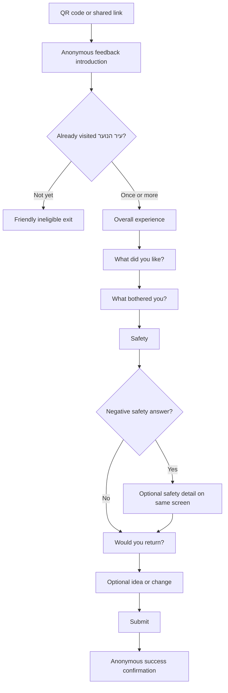

# PRD: Anonymous Feedback for "עיר הנוער"

| Field | Value |
| --- | --- |
| Status | Draft for product review |
| Version | 0.1 |
| Date | 2026-07-30 |
| Primary audience | Teen visitors, designed for age 13 |
| Product language | Hebrew, RTL |
| Primary device | Mobile phone |
| Survey stage | Post-visit feedback for an already active venue |

## 1. Summary

Create a short, anonymous, mobile-first feedback experience for teens who have already visited "עיר הנוער" in Netanya.

The form must help the team understand:

- How teens experienced the venue overall.
- What they liked.
- What bothered them or did not work.
- Whether they felt safe.
- Whether they want to return.
- What they most want the team to keep, add, or change.

The experience must feel safe, direct, and age-appropriate. It must not feel like a municipal questionnaire or describe teens as a problem to be managed.

## 2. Context and problem

"עיר הנוער" is already operating and includes gaming and technology, sports and table games, social seating areas, staff and security, and return transport.

The project team currently needs honest feedback from teens who have experienced the venue. A broad youth-needs survey would not answer that question. The product must measure the real "עיר הנוער" experience specifically.

Teens may avoid honest criticism if they believe:

- Their identity can be discovered.
- Staff will see who submitted a complaint.
- The form is long, formal, or difficult on a phone.
- Nothing will happen after they submit feedback.

The form must reduce those concerns without making anonymity claims that the implementation cannot technically support.

## 3. Product goal

Enable a teen visitor to share useful, honest feedback about "עיר הנוער" anonymously in approximately 60–90 seconds on a mobile phone.

### Goals

1. Collect structured feedback that can be compared across submissions.
2. Collect optional free-text ideas and complaints in the teen's own words.
3. Identify the strongest positive experiences and the most common problems.
4. Measure perceived safety and intention to return.
5. Protect the respondent's anonymity by product design and technical implementation.
6. Make the form understandable and comfortable for a 13-year-old.

### Non-goals

- Measuring interest before the venue opens.
- Collecting general feedback about youth life or municipal services in Netanya.
- Identifying, contacting, or following up with individual respondents.
- Collecting names, phone numbers, email addresses, schools, classes, neighborhoods, or exact visit times.
- Acting as an emergency, safeguarding, or real-time incident-reporting channel.
- Publishing raw submissions or creating a public social feed.
- Voting, commenting, or reacting to other teens' submissions.
- Building a full staff analytics dashboard in v1.

## 4. Target user and job to be done

### Primary user

A teen visitor, designed around age 13, using a phone shortly after spending time at "עיר הנוער."

### Job to be done

> After I visit "עיר הנוער," I want to say what was good and what should change without giving my identity, so the place can become better for teens like me.

### Usage context

- The teen may arrive from a QR code at the venue exit or on return transport.
- They may be standing, walking, or using the phone one-handed.
- Their attention may be limited.
- They may be surrounded by friends or staff and need privacy.
- Connectivity may be slow or interrupted.

## 5. Product principles

1. **Specific to the real venue:** Every question must help evaluate "עיר הנוער."
2. **Anonymous by design:** Do not collect information that is unnecessary or identifying.
3. **One task per screen:** Ask one clear question at a time.
4. **Easy to criticize:** Negative feedback must be as easy to submit as positive feedback.
5. **Teen-friendly, not childish:** Use direct Hebrew, familiar words, and a mature visual tone.
6. **No judgmental framing:** Do not mention "wandering youth," antisocial behavior, or imply that teens are the problem.
7. **Actionable over exhaustive:** Prefer a short set of useful questions over a comprehensive survey.
8. **Honest trust language:** Explain what is and is not collected without overpromising.

## 6. Experience flow

## 7. Screen and question specification

### Screen 0: Introduction

**Purpose:** Establish the topic, time commitment, and anonymity before asking for effort.

**Hebrew copy:**

> ## איך היה לך בעיר הנוער?
>
> מה היה טוב ומה כדאי לשנות?
>
> לא מבקשים שם או טלפון. השאלון לוקח פחות משתי דקות.

Primary action:

> **מתחילים**

Secondary expandable link:

> **איך זה אנונימי?**

The anonymity explanation must state, in plain Hebrew, what the deployed product actually collects and does not collect. The final copy cannot be approved until the technical behavior has been verified.

### Question 1: Visit eligibility

**Hebrew copy:**

> **כמה פעמים יצא לך להגיע לעיר הנוער?**

**Type:** Single-select cards  
**Required:** Yes

Options:

- פעם אחת
- יותר מפעם אחת
- עוד לא הגעתי

**Logic:**

- "פעם אחת" and "יותר מפעם אחת" continue to Question 2.
- "עוד לא הגעתי" opens the ineligible exit and does not create a venue-experience response.

**Ineligible exit:**

> **השאלון הזה מיועד למי שכבר ביקרו בעיר הנוער**
>
> נשמח לשמוע ממך אחרי הביקור.

### Question 2: Overall experience

**Hebrew copy:**

> **איך היה הביקור בסך הכול?**

**Type:** Single-select labeled cards  
**Required:** Yes

Options:

- 🤩 מעולה
- 🙂 די טוב
- 😐 לא משהו
- 🙁 ממש לא טוב

Icons or emoji may support recognition, but the text label must always remain visible.

### Question 3: Positive experience

**Hebrew copy:**

> **מה היה הכי טוב?**
>
> אפשר לבחור עד 3.

**Type:** Multi-select cards  
**Required:** Yes

Options:

- גיימינג וטכנולוגיה
- כדורגל וספורט
- פינג פונג ומשחקי שולחן
- פינות הישיבה
- להיות עם חברים
- האווירה
- הצוות במקום
- לא היה משהו שאהבתי
- משהו אחר

**Logic:**

- Limit selection to three choices.
- "לא היה משהו שאהבתי" is exclusive and clears all other selections.
- "משהו אחר" reveals an inline field with a 150-character limit.
- The inline field becomes required while "משהו אחר" is selected.
- Deselecting "משהו אחר" clears and excludes its hidden value.
- Show the personal-information warning beside the inline field.

### Question 4: Problems and complaints

**Hebrew copy:**

> **מה היה פחות טוב?**
>
> אפשר לבחור עד 3.

**Type:** Multi-select cards  
**Required:** Yes

Options:

- היה צפוף מדי
- היה רועש מדי
- חיכיתי הרבה לפעילויות
- ציוד לא עבד
- לא היה מספיק ציוד
- ההתנהגות של בני נוער אחרים
- היחס של אנשי הצוות
- היחס של אנשי האבטחה
- לא היו מספיק דברים לעשות
- השעות לא התאימו
- ההסעה חזרה
- הניקיון
- שום דבר לא הפריע
- משהו אחר

**Logic:**

- Limit selection to three choices.
- "שום דבר לא הפריע" is exclusive and clears all other selections.
- "משהו אחר" reveals an inline field with a 150-character limit.
- The inline field becomes required while "משהו אחר" is selected.
- Deselecting "משהו אחר" clears and excludes its hidden value.
- Show the personal-information warning beside the inline field.

### Question 5: Safety

**Hebrew copy:**

> **עד כמה המקום הרגיש בטוח?**

**Type:** Single-select cards  
**Required:** Yes

Options:

- בטוח מאוד
- די בטוח
- לא כל כך בטוח
- בכלל לא בטוח

**Conditional follow-up:**

Show only after "לא כל כך בטוח" or "בכלל לא בטוח." Keep the follow-up inline on the same question screen so progress remains accurate.

> **אפשר לספר מה גרם להרגשה הזאת**
>
> לא חייבים לענות.
>
> לא לכתוב שמות או פרטים שמזהים אותך או אנשים אחרים.

**Type:** Multiline free text  
**Required:** No  
**Maximum length:** 500 characters

If the answer changes to "בטוח מאוד" or "די בטוח," clear and exclude any hidden safety-detail value.

The screen must also state:

> אם יש סכנה עכשיו, כדאי לפנות מיד לאיש או אשת צוות במקום או למבוגר שסומכים עליו. הטופס לא נבדק בזמן אמת.

### Question 6: Return intention

**Hebrew copy:**

> **יש סיכוי לעוד ביקור?**

**Type:** Single-select cards  
**Required:** Yes

Options:

- בטוח שכן
- אולי
- לא

### Question 7: Idea or change

**Hebrew copy:**

> **מה הדבר הראשון שכדאי להוסיף או לשנות?**

Helper text:

> אפשר לכתוב רעיון חדש או להסביר משהו שכדאי לתקן.
>
> לא חייבים לענות.
>
> לא לכתוב שם, טלפון או פרטים אישיים.

**Type:** Multiline free text  
**Required:** No  
**Maximum length:** 1,000 characters

The field must be large enough to show at least four lines without scrolling internally.

Primary action:

> **לשלוח**

The visible back action remains available for corrections; v1 does not add a separate review screen.

### Submission state

Requirements:

- Show visible progress immediately after the submit action.
- Disable repeated submission while a request is in progress.
- Treat the request as idempotent so retries do not create accidental duplicates.
- Preserve all answers if the request fails.

Error copy:

> **לא הצלחנו לשלוח כרגע**
>
> התשובות עדיין כאן. אפשר לבדוק את החיבור ולנסות שוב.

Primary action:

> **לנסות שוב**

### Success screen

**Hebrew copy:**

> ## תודה על השיתוף 💙
>
> המשוב נשלח בלי השם שלך ויעזור לשפר את עיר הנוער.

Action:

- **סיימתי**

Repeat submissions are allowed because a teen may have a different experience on a later visit. The product must not use persistent tracking to prevent repeat submissions.

## 8. Mobile interaction requirements

- Hebrew RTL is the default layout direction.
- The experience must work without horizontal scrolling from 320px viewport width.
- Use a single-column layout.
- Use a minimum 16px body text size.
- Interactive targets must be at least 48×48px with sufficient space between them.
- The primary action must remain reachable when the on-screen keyboard is open.
- Do not auto-advance immediately after a selection; allow the teen to correct a mistap before continuing.
- Show a simple step indicator such as **שלב 3 מתוך 7**.
- Provide a visible back action on every question screen.
- Preserve completed answers when moving backward and forward.
- Mark optional fields explicitly.
- Do not use dropdowns for primary survey answers.
- Do not use color alone to communicate selected, error, or success states.
- Support keyboard navigation, visible focus, semantic labels, and screen-reader announcements.
- Respect reduced-motion preferences.
- Avoid decorative motion during reading or text entry.

## 9. Anonymity and privacy requirements

The product may describe a submission as anonymous only when all requirements below have been verified in the deployed environment.

### Do not collect

- Name
- Phone number
- Email address
- School or class
- Neighborhood or home address
- Exact visit date or time
- Account or login
- Advertising identifier
- Device fingerprint
- Persistent visitor identifier
- Precise location
- IP address in the feedback record
- User-agent or referrer in the feedback record

### Technical requirements

- Do not load third-party advertising or behavioral analytics scripts.
- Do not attach infrastructure request metadata to a feedback response.
- Infrastructure and proxy logs must be disabled, anonymized, or minimized according to an approved privacy policy before the product claims full anonymity.
- Use only session-scoped client state while completing the form. It may survive a refresh in the same tab but must not survive closing the tab.
- Clear form state after successful submission.
- Do not keep a completed response in persistent browser storage.
- Generate a random submission ID that is not linked to a person or device.
- Anti-abuse controls must not create a persistent identity. Any temporary rate-limiting mechanism must have a short documented lifetime and must not be written into response data.
- Free-text content must never be automatically published.
- Access to raw responses must be restricted to approved reviewers.
- Define and approve a response-retention period before production launch.
- Verify the final Hebrew privacy wording against actual production logging and storage behavior.

### Free-text handling

- Warn respondents not to include personal information before each free-text field.
- Apply length limits and safe text handling.
- Treat submitted free text as potentially containing personal or sensitive information even when the form does not request it.
- Provide reviewers a process for redacting accidentally submitted identifying details.

## 10. Data captured

Each eligible submission contains only:

| Field | Type | Notes |
| --- | --- | --- |
| `submission_id` | Random identifier | Not linked to a person or device |
| `submission_day` | Date bucket | Do not expose exact request time in routine analysis |
| `visit_frequency` | Enum | Once / more than once |
| `overall_experience` | Enum | Four labeled levels |
| `liked_elements` | Array | Maximum three |
| `liked_other` | Text, optional | Maximum 150 characters |
| `problems` | Array | Maximum three |
| `problem_other` | Text, optional | Maximum 150 characters |
| `safety` | Enum | Four labeled levels |
| `safety_detail` | Text, optional | Maximum 500 characters |
| `return_intent` | Enum | Definitely yes / maybe / no |
| `idea_or_change` | Text, optional | Maximum 1,000 characters |
| `completion_time_bucket` | Enum | Under 60s / 60–90s / 91–180s / over 180s; calculated locally |

No demographic fields are required in v1. If the survey is later expanded beyond the current target audience, age bands may be considered only through a separate privacy and product decision.

## 11. Feedback review and operations

V1 must store responses in an approved, access-controlled destination so designated staff can review them. The staff-facing analytics dashboard is not part of this PRD.

Before launch, the product owner must define:

- Which team owns incoming feedback.
- Which named roles may read raw free text.
- How often feedback is reviewed.
- How urgent safety-related language is handled, given that the form is not monitored in real time.
- How identifying information accidentally included in free text is redacted.
- The retention and deletion policy.
- The approved mechanism for aggregate reporting or secure export.

Raw responses must not be sent through public channels, embedded in public analytics, or shared with unnecessary recipients.

## 12. Success measures

### Initial UX targets

- At least 70% completion among eligible respondents who begin Question 2.
- Median completion time of 90 seconds or less.
- At least 99% technically successful submissions, excluding a respondent's loss of connectivity.
- No required question causes more than 10% of eligible users to abandon the form.

These are launch targets, not established baselines. Review them after the first week of real usage.

### Privacy-safe measurement plan

- Maintain aggregate-only counters for eligible starts, each question reached, submit attempts, successful submissions, and failed submissions.
- Aggregate counters must contain no submission ID, session ID, IP address, user agent, referrer, or raw event history.
- Calculate completion duration in the browser and submit only a coarse duration bucket with completed feedback.
- Do not store exact start time or exact duration.
- Do not join aggregate funnel counters back to individual feedback records.
- The measurement endpoints are subject to the same infrastructure logging restrictions as the feedback endpoint.

### Product indicators

- Distribution of overall-experience responses.
- Most selected positive elements.
- Most selected problems.
- Percentage answering "לא כל כך בטוח" or "בכלל לא בטוח" to safety.
- Percentage answering "בטוח שכן", "אולי", or "לא" to returning.
- Weekly themes from optional free text.
- Percentage of respondents who report more than one visit.

### Guardrails

- Zero intentionally collected direct identifiers.
- Zero raw responses publicly exposed.
- No unverified anonymity claim in production copy.
- No pressure to provide optional free text.

## 13. Distribution

Recommended initial distribution:

- QR code at the venue exit.
- QR code on return transport.
- A short URL beneath the QR code for accessibility.
- Optional follow-up link in an official youth channel, clearly stating that the form is for teens who already visited.

The QR placement should allow a teen to scan without asking staff for permission or revealing whether they intend to leave criticism.

## 14. Required states and edge cases

The product must support:

- First load
- Answer selected
- Exclusive answer replacing previous selections
- Maximum selection reached
- Optional "other" field revealed and hidden
- Conditional safety field
- Back navigation
- Submitting
- Successful submission
- Server error
- Offline or interrupted connection
- Retried submission
- Ineligible respondent
- Empty optional fields
- Maximum text length
- Hebrew, emoji, punctuation, and line breaks safely accepted, encoded, and sanitized
- Narrow viewport with the keyboard open
- Reduced motion
- Right-to-left screen-reader order

## 15. Acceptance criteria

1. A visitor can complete the entire eligible path on a 320px-wide screen without horizontal scrolling.
2. The form displays one primary question per screen in Hebrew RTL.
3. An ineligible respondent cannot accidentally enter the post-visit rating flow.
4. Required questions cannot be skipped, and errors explain how to continue.
5. "Nothing" options behave exclusively in multi-select questions.
6. Selecting "Other" requires its text field; deselecting it clears and excludes the hidden value.
7. Changing a negative safety answer to a positive answer clears and excludes the hidden safety detail.
8. Negative safety answers reveal the optional safety follow-up and real-time-monitoring warning.
9. Back actions preserve all answers.
10. A network or server error preserves the completed form in the current tab and offers a retry.
11. Repeated submit taps do not create accidental duplicate records.
12. The success screen appears only after confirmed persistence.
13. The respondent is never asked for contact, school, location, or other identifying information.
14. No persistent tracking identifier is created to block repeat feedback.
15. The deployed privacy explanation matches verified logging and storage behavior.
16. Raw free text is accessible only through an approved restricted process.
17. The main path is tested with a screen reader, keyboard navigation, reduced motion, and at least one real mobile viewport.
18. In a supervised usability check that follows the required consent process, at least four of five representative age-13 participants complete the main path without assistance in 90 seconds or less.

## 16. Out-of-scope follow-ups

Potential later work, requiring separate product decisions:

- Staff analytics and moderation dashboard.
- Public "you said / we changed" aggregate updates.
- Anonymous status tracking for submitted themes.
- A separate non-visitor survey about why teens have not attended.
- Additional languages.
- Post-event or activity-specific feedback.
- Trend comparison across different operating periods.

## 17. Open decisions

These decisions must be resolved before production release:

1. Who owns and reviews submissions?
2. Where are responses stored?
3. What is the approved retention period?
4. What infrastructure logging is active, and can it support the anonymity promise?
5. What secure export or review mechanism will staff use?
6. Where will the QR code be placed and who maintains it?
7. What visual identity should the form use: the existing "עיר הנוער" identity or a neutral feedback identity?
